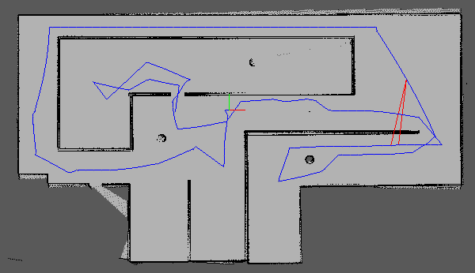

# Project 3 - Map My World

This project uses Real-Time Appearance-Based Mapping (RTAB-Map) implementation of
Simultaneous Localization and Mapping (SLAM) in ROS to build both 2D occupancy grid map and 3D
octomaps from the provided simulated environment as well as personal built environment using
mobile robot. RTAB-Map SLAM algorithm uses data collected from vision sensor to localize the
robot and map the environment and also uses a process called loop closure to determine whether the robot has seen a location before.

## [Link to Rtabmap database in my Google Drive](https://drive.google.com/file/d/1emnlnBMb5CEzjMHHMdbTyZThEBD59rS4/view?usp=sharing)

## Result


### How to clone this repository
```
$ cd ~/catkin_ws

$ git clone https://github.com/cryptSky/RoboND_Map_My_World
```

