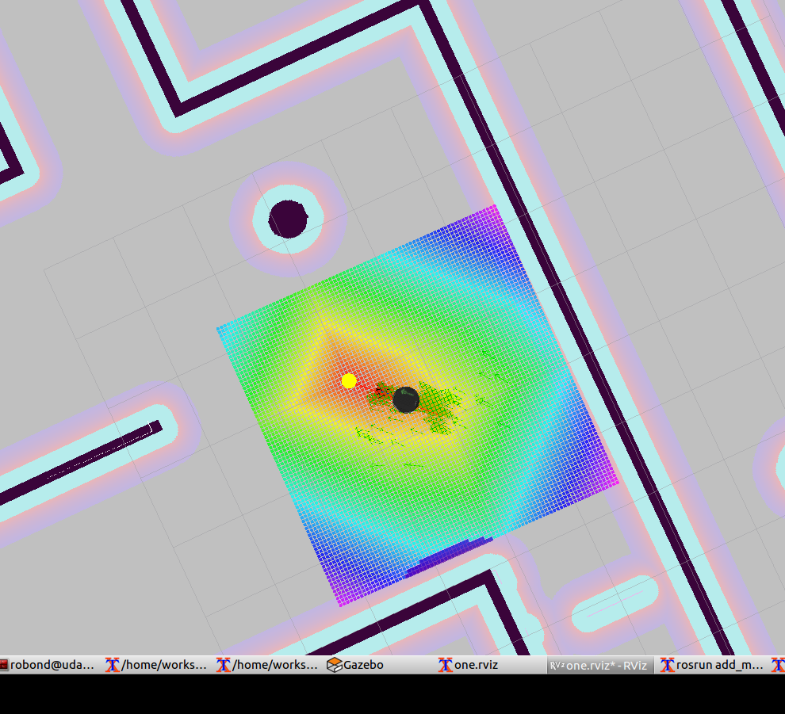

In this project I have put togather solution and implemented the two nodes to pick up and drop a can, which home service robot to performs using SLAM on built map of the environment. Using rviz markers as a can visual representation, robot navigation system performs navigation to desired pick up location and to drop off location.

To install, clone the repository to /home/workspace. The command below will pull all required submodules and copy directly to Catkin Workspace.
`git clone https://github.com/cryptSky/RoboND_Home_Service_Robot.git .`

Once all the necessary files are in place, run the following commands from the catkin_ws directory:
1. `source devel/setup.bash`
2. `catkin_make`
3. `sudo chmod 7 src/scripts/*.sh`

# Running
From the `catkin_ws/` directory run the following command:
`./src/scripts/home_service.sh`
